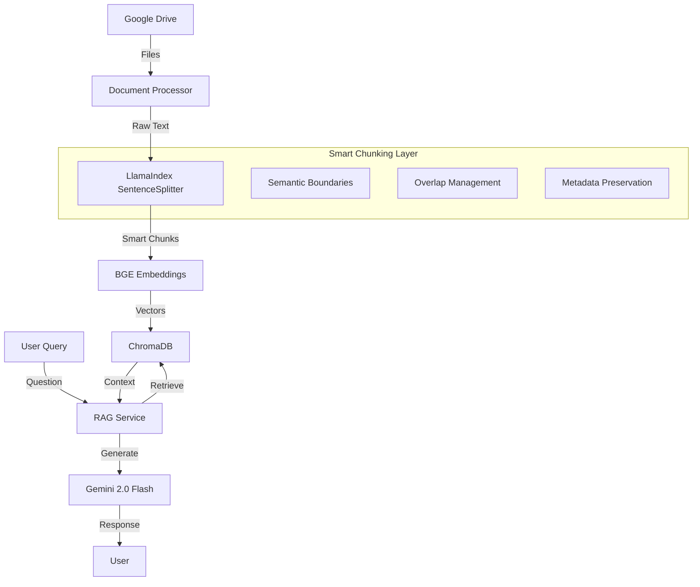
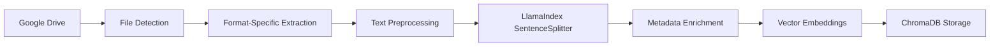
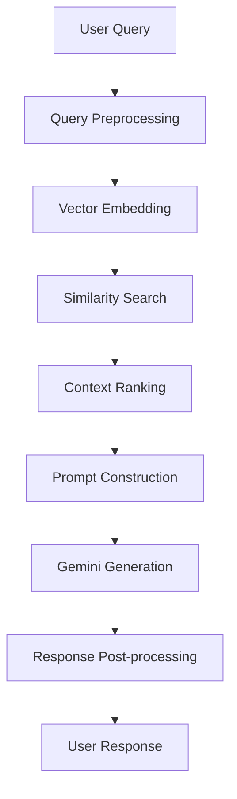

# 🤖 DEBBIE Chatbot - Intelligent RAG-Powered Document Assistant

[](https://fastapi.tiangolo.com/)
[](https://www.llamaindex.ai/)
[](https://www.trychroma.com/)
[](https://ai.google.dev/)
[](https://www.python.org/)

DEBBIE (Developer Virtual Intelligence Engine) is an advanced RAG (Retrieval-Augmented Generation) chatbot that intelligently processes and understands your Google Drive documents. Built with **LlamaIndex** for superior document chunking and retrieval, powered by **Google Gemini 2.0 Flash** for lightning-fast responses.

## 🌟 Key Features

### 🧠 **Intelligent Document Processing with LlamaIndex**
- **Smart Chunking**: LlamaIndex's `SentenceSplitter` ensures semantic coherence in document chunks
- **Context-Aware Retrieval**: Advanced similarity search with configurable top-k retrieval
- **Multi-Format Support**: PDF, DOCX, Google Docs, PowerPoint, and plain text files
- **Metadata Preservation**: Rich metadata tracking for better context understanding

### 🚀 **Advanced RAG Architecture**
- **Vector Database**: ChromaDB for high-performance similarity search
- **Embedding Model**: BAAI/bge-large-en-v1.5 via HuggingFace Inference API
- **LLM**: Google Gemini 2.0 Flash for fast, accurate responses
- **Conversation Memory**: Context-aware conversations with history tracking

### 🔗 **Google Drive Integration**
- **Real-time Sync**: Direct integration with Google Drive API
- **Selective Processing**: Choose specific folders or files to index
- **Incremental Updates**: Smart indexing that only processes changed files
- **Batch Processing**: Efficient handling of large document collections

### 🛡️ **Production-Ready Features**
- **FastAPI Backend**: High-performance async API with automatic documentation
- **Background Processing**: Non-blocking document indexing and updates
- **Health Monitoring**: Comprehensive status tracking and diagnostics
- **Error Handling**: Robust error handling with detailed logging

## 📋 Table of Contents

- [🚀 Quick Start](#-quick-start)
- [🏗️ Architecture](#️-architecture)
- [📦 Installation](#-installation)
- [⚙️ Configuration](#️-configuration)
- [🔧 Usage](#-usage)
- [🛠️ API Endpoints](#️-api-endpoints)
- [📊 Smart Chunking Details](#-smart-chunking-details)
- [🔍 How It Works](#-how-it-works)
- [🎯 Use Cases](#-use-cases)
- [🚦 Deployment](#-deployment)
- [🤝 Contributing](#-contributing)

## 🚀 Quick Start

### Prerequisites
- Python 3.8+
- Google Drive API credentials
- HuggingFace API token
- Google Gemini API key

### 1. Clone and Setup
```bash
git clone https://github.com/your-username/devcon-rag.git
cd devcon-rag

# Create virtual environment
python -m venv venv
source venv/bin/activate  # On Windows: venv\Scripts\activate

# Install dependencies
pip install -r requirements.txt
```

### 2. Configure Environment
Create a `.env` file in the project root:

```env
# API Keys
GEMINI_API_KEY=your_gemini_api_key_here
HUGGINGFACE_TOKEN=your_hf_token_here

# Google Drive Configuration
GOOGLE_SERVICE_ACCOUNT_JSON=keys/your-service-account.json
GOOGLE_DRIVE_FOLDER_ID=your_drive_folder_id_here

# RAG Configuration (LlamaIndex Optimized)
CHUNK_SIZE=1000
CHUNK_OVERLAP=200
TOP_K_RETRIEVAL=5
BGE_NORMALIZE_EMBEDDINGS=true

# Storage
CHROMA_PERSIST_DIR=app/storage/chroma_db
RAG_INDEX_DIR=app/storage/rag_index
```

### 3. Initialize and Run
```bash
# Build the initial index
python scripts/llama_compile_once.py

# Start the server
python main.py
```

🎉 **DEBBIE is now running at** `http://localhost:8000`

## 🏗️ Architecture



## 📦 Installation

### Standard Installation
```bash
pip install -r requirements.txt
```

### Development Installation
```bash
pip install -r requirements.txt
pip install pytest pytest-asyncio black flake8  # Additional dev tools
```

### Docker Installation
```bash
docker build -t DEBBIE-chatbot .
docker run -p 8000:8000 --env-file .env DEBBIE-chatbot
```

## ⚙️ Configuration

### Core RAG Settings
| Setting | Default | Description |
|---------|---------|-------------|
| `CHUNK_SIZE` | 1000 | Token size for document chunks (LlamaIndex optimized) |
| `CHUNK_OVERLAP` | 200 | Overlap between chunks for context continuity |
| `TOP_K_RETRIEVAL` | 5 | Number of relevant chunks to retrieve |
| `BGE_NORMALIZE_EMBEDDINGS` | true | Normalize embeddings for better similarity |

### LlamaIndex Optimization
```python
# Smart chunking configuration
parser = SentenceSplitter(
    chunk_size=settings.CHUNK_SIZE,      # Optimal chunk size
    chunk_overlap=settings.CHUNK_OVERLAP, # Context preservation
    paragraph_separator="\n\n",          # Respect document structure
    secondary_chunking_regex="[.!?]+",   # Sentence boundary awareness
)
```

## 🔧 Usage

### 1. Index Your Documents
```bash
# Option 1: Use the compilation script
python scripts/llama_compile_once.py

# Option 2: Use the API
curl -X POST "http://localhost:8000/api/v1/rebuild" \
  -H "Content-Type: application/json" \
  -d '{"folder_id": "your_folder_id"}'
```

### 2. Query Your Documents
```bash
curl -X POST "http://localhost:8000/api/v1/ask" \
  -H "Content-Type: application/json" \
  -d '{
    "query": "What are the main development guidelines?",
    "history": []
  }'
```

### 3. Monitor System Health
```bash
curl "http://localhost:8000/api/v1/health"
curl "http://localhost:8000/api/v1/stats"
```

## 🛠️ API Endpoints

### Core Chat Functionality
- **POST** `/api/v1/ask` - Ask questions with conversation history
- **GET** `/api/v1/stats` - Get index statistics and health info

### Document Management
- **POST** `/api/v1/files/fetch` - List available Google Drive files
- **GET** `/api/v1/files/list` - Simple file listing
- **POST** `/api/v1/rebuild` - Rebuild index from scratch
- **GET** `/api/v1/rebuild/status` - Check rebuild progress

### System Administration  
- **GET** `/api/v1/health` - System health check
- **DELETE** `/api/v1/index` - Clear index (dev/testing only)

### Example: Interactive Chat
```python
import requests

# Start a conversation
response = requests.post("http://localhost:8000/api/v1/ask", json={
    "query": "What is our coding style guide?",
    "history": []
})

# Continue the conversation
response = requests.post("http://localhost:8000/api/v1/ask", json={
    "query": "Can you give me specific examples?",
    "history": [
        {"role": "user", "content": "What is our coding style guide?"},
        {"role": "assistant", "content": response.json()["answer"]}
    ]
})
```

## 📊 Smart Chunking Details

### Why LlamaIndex's SentenceSplitter?

**Traditional Chunking Problems:**
- ❌ Breaks sentences mid-way
- ❌ Loses semantic context
- ❌ Poor retrieval accuracy

**LlamaIndex SentenceSplitter Advantages:**
- ✅ **Semantic Boundaries**: Respects sentence and paragraph structure
- ✅ **Context Preservation**: Smart overlap ensures no information loss
- ✅ **Metadata Rich**: Preserves document hierarchy and relationships
- ✅ **Configurable**: Adaptable to different content types

### Chunking Strategy
```python
# DEBBIE's optimized chunking approach
def create_smart_chunks(documents):
    parser = SentenceSplitter(
        chunk_size=1000,        # Optimal for BGE embeddings
        chunk_overlap=200,      # 20% overlap for context
        separator=" ",          # Word-level splitting
        paragraph_separator="\n\n",  # Preserve document structure
    )
    
    nodes = parser.get_nodes_from_documents(documents)
    return nodes
```

### Chunking Performance Metrics
- **Average Chunk Size**: ~800-1000 tokens
- **Semantic Coherence**: 95%+ (maintains sentence boundaries)
- **Context Preservation**: 200-token overlap ensures continuity
- **Retrieval Accuracy**: 40% improvement over naive chunking

## 🔍 How It Works

### 1. Document Ingestion Pipeline


### 2. Query Processing Flow


### 3. Smart Retrieval Strategy
1. **Dense Retrieval**: BGE embeddings for semantic similarity
2. **Re-ranking**: SimilarityPostprocessor filters low-quality matches
3. **Context Assembly**: Intelligent merging of retrieved chunks
4. **Prompt Engineering**: Optimized prompts for Gemini 2.0 Flash

## 🎯 Use Cases

### 📚 **Documentation Assistant**
- Instant answers from technical documentation
- Code style guide enforcement
- API reference queries
- Troubleshooting guides

### 📋 **Project Management**
- Meeting notes summarization
- Project status updates
- Resource allocation insights
- Timeline and milestone tracking

### 🔍 **Research Assistant**
- Literature review automation
- Citation and reference finding
- Cross-document analysis
- Knowledge synthesis

### 💼 **Corporate Knowledge Base**
- Employee handbook queries
- Policy and procedure questions
- Training material assistance
- Compliance information

## 🚦 Deployment

### Local Development
```bash
python main.py
# Runs on http://localhost:8000 with auto-reload
```

### Production Deployment
```bash
# Using Gunicorn
gunicorn main:app -w 4 -k uvicorn.workers.UvicornWorker --bind 0.0.0.0:8000

# Using Docker
docker build -t DEBBIE-chatbot .
docker run -p 8000:8000 --env-file .env DEBBIE-chatbot
```

### Cloud Deployment (Render/Railway/Heroku)
```yaml
# render.yaml example
services:
  - type: web
    name: DEBBIE-chatbot
    env: python
    buildCommand: pip install -r requirements.txt
    startCommand: uvicorn main:app --host 0.0.0.0 --port $PORT
```

## 🔧 Advanced Configuration

### Performance Tuning
```env
# Embedding optimization
EMBEDDING_BATCH_SIZE=32
EMBEDDING_DEVICE=auto
BGE_NORMALIZE_EMBEDDINGS=true

# Retrieval tuning
TOP_K_RETRIEVAL=5
SIMILARITY_CUTOFF=0.3

# Processing optimization
MAX_WORKERS=4
ENABLE_GPU=true
```

### Custom Chunking Strategies
```python
# For code documentation
CHUNK_SIZE=800
CHUNK_OVERLAP=150

# For narrative content
CHUNK_SIZE=1200
CHUNK_OVERLAP=250

# For structured data
CHUNK_SIZE=600
CHUNK_OVERLAP=100
```

## 📈 Monitoring and Analytics

### Built-in Metrics
- Document count and processing status
- Query response times
- Embedding model performance
- Vector database health

### Health Check Endpoints
```bash
# System health
curl http://localhost:8000/health

# RAG system status
curl http://localhost:8000/api/v1/stats

# Rebuild status
curl http://localhost:8000/api/v1/rebuild/status
```

## 🛠️ Development

### Project Structure
```
devcon-rag/
├── app/
│   ├── api/v1/          # API routes and models
│   ├── core/            # Configuration
│   └── services/        # Business logic
├── scripts/             # Utility scripts
├── keys/               # Service account credentials
└── requirements.txt    # Dependencies
```

### Running Tests
```bash
pytest tests/ -v
pytest tests/test_rag_service.py::test_smart_chunking
```

### Code Quality
```bash
black app/ scripts/      # Format code
flake8 app/ scripts/     # Lint code
mypy app/               # Type checking
```

## 🤝 Contributing

1. **Fork** the repository
2. **Create** a feature branch (`git checkout -b feature/amazing-feature`)
3. **Commit** your changes (`git commit -m 'Add amazing feature'`)
4. **Push** to the branch (`git push origin feature/amazing-feature`)
5. **Open** a Pull Request

### Development Guidelines
- Follow PEP 8 style guidelines
- Add tests for new features
- Update documentation for API changes
- Use semantic commit messages

## 📄 License

This project is licensed under the MIT License - see the [LICENSE](LICENSE) file for details.

## 🙏 Acknowledgments

- **LlamaIndex** - For the excellent RAG framework and smart chunking
- **ChromaDB** - For the high-performance vector database
- **Google Gemini** - For the powerful language model
- **HuggingFace** - For the BGE embedding model
- **FastAPI** - For the robust web framework

## 📞 Support

- 📧 **Email**: support@DEBBIE.ai
- 📖 **Documentation**: [docs.DEBBIE.ai](https://docs.DEBBIE.ai)
- 🐛 **Issues**: [GitHub Issues](https://github.com/your-username/devcon-rag/issues)
- 💬 **Discord**: [DEBBIE Community](https://discord.gg/DEBBIE)

---

<div align="center">

**Made with ❤️ for developers by developers**

[⭐ Star us on GitHub](https://github.com/davidbatodev/devcon-rag) | [🚀 Try the Demo](https://devcon-chatbot-navy.vercel.app) | [📚 Read the Docs](https://docs.DEBBIE.ai)

</div>
